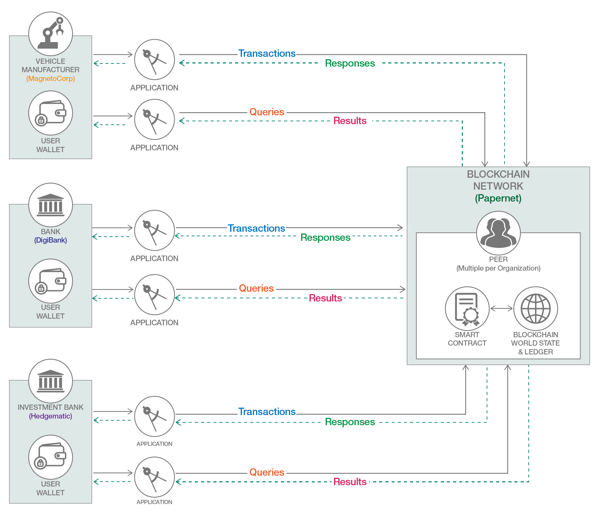

---
# Front matter (metadata).

abstract: "Deploy a sample commercial paper smart contract to a v2 Hyperledger Fabric blockchain and connect to it with the IBM Blockchain Platform VS Code extension, and client applications."

authors:
  - name: "Paul O'Mahony"
    email: "mahoney@uk.ibm.com"

completed_date: "2020-06-21"

components:
  - "hyperledger-fabric"
  - "hyperledger"
  - "vscode-extension"

draft: true 

excerpt: "Learn how to deploy and run a sample commercial paper smart contract using Hyperledger Fabric and the IBM Blockchain Platform VS Code extension."

meta_description: "Run a sample commercial paper smart contract on a Hyperledger Fabric v2 blockchain using the IBM Blockchain Platform VS Code extension."

meta_keywords: "commercial paper, smart contract, IBM Blockchain, VS Code extension, Hyperledger Fabric"

last_updated: "2020-06-30"

primary_tag: "blockchain"

pta:
 - "emerging technology and industry"

pwg:
  - "blockchain"

related_content:
  - type: announcements
    slug: ibm-blockchain-platform-vscode-smart-contract
  - type: articles
    slug: make-smart-contracts-smarter-with-analytics
  - type: patterns
    slug: create-and-execute-blockchain-smart-contracts

related_links:
  - title: "Video: Start developing with the IBM Blockchain Platform VS Code Extension"
    url: "https://youtu.be/0NkGGIUPhqk"
  - title: "Sample commercial paper smart contract"
    url: "https://github.com/hyperledger/fabric-samples"
  - title: "Hyperledger Fabric docs: Commercial paper tutorial"
    url: "https://hyperledger-fabric.readthedocs.io/en/master/tutorial/commercial_paper.html"

# runtimes:

# series:                 # OPTIONAL
#  - type:
#    slug:

services:
 - "blockchain"

subtitle: "Develop blockchain apps and smart contracts easily with the IBM Blockchain Platform extension and the latest Hyperledger Fabric features"

tags:
  - "finance"

title: "Deploy and run a commercial paper smart contract with the IBM Blockchain VS Code extension"

type: tutorial

private_portals:
  - "blockchain"

---

Using the new [IBM Blockchain Platform VS Code extension](https://marketplace.visualstudio.com/items?itemName=IBMBlockchain.ibm-blockchain-platform) and the latest Hyperledger Fabric features, developing blockchain applications and smart contracts couldn't be simpler! The extension is a powerful and intuitive tool that enables developers to develop use cases, and start developing your pilot projects. The extension allows the application developer to easily generate, code, test, debug, package, and deploy smart contracts to a blockchain network; you can also develop your client applications using a single tool. What better way to illustrate than to show the IBM Blockchain Platform VS Code extension in action! 

This tutorial shows you how to deploy a sample Commercial Paper smart contract to a Fabric-based blockchain network, and try out its transactions using the IBM Blockchain Platform VS Code extension. You'll also interact with the contract and perform transactions using Node.js client applications. The Commercial Paper sample you will work with is available from Fabric Samples on [GitHub](https://github.com/hyperledger/fabric-samples).

**Note:** This is the first of a three-part [tutorial series](https://developer.ibm.com/series/blockchain-running-enhancing-commercial-paper-smart-contract/). [Part 2](https://developer.ibm.com/tutorials/queries-commercial-paper-smart-contract-ibm-blockchain-vscode-extension/) builds on this, adding simple and advanced queries to the contract to pull data from the ledger.

**Figure 1: “Commerce” — overview of the Commercial Paper network and its members, used in this tutorial series**

## Background

Commercial paper has existed since at least the 19th century. What is it? Well, for a detailed description, check out the [Fabric Developing Applications](https://hyperledger-fabric.readthedocs.io/en/master/tutorial/commercial_paper.html) pages. In short, it's a way for large institutions to obtain funds to meet short-term debt obligations. For example,  let's say MagnetoCorp issues a commercial paper (or "CP") on April 1 with a face value of $1m. It promises to pay the bearer this amount in 6 months' time (October 1, the maturity date) - the "paper" is a transferable asset, so it can be re-sold in a marketplace. On May 1,  the CP is purchased by an investment bank (DigiBank) for a discounted price -- $0.96 million; MagnetoCorp gets the liquidity it needs. If DigiBank holds this until maturity (managing its investment risk in the meantime), it can redeem it at face value ($1 million) with MagnetoCorp -- a profit of $40,000. This is equivalent to guaranteed interest earned on an investment of $0.96m over 6 months. Most investors in the commercial paper marketplace tend to hold it until maturity, but there are varying marketplaces, options, and strategies ... far beyond the scope of this little explainer.

## Pre-requisites

The list of installation pre-requisites for the [IBM Blockchain Platform VS Code extension](https://marketplace.visualstudio.com/items?itemName=IBMBlockchain.ibm-blockchain-platform#user-content-dependency-installation)

Also check out the extension in the [marketplace](https://marketplace.visualstudio.com/items?itemName=IBMBlockchain.ibm-blockchain-platform) for more information.

You can check your versions using the following commands e.g.

* `node --version`
* `npm --version`
* `code --version`

## Estimated time

After the prerequisites are installed, this tutorial should take approximately 45 minutes to complete.

To complete the steps for this tutorial [follow the tutorial steps here](https://github.com/mahoney1/commercialpaper/blob/master/tutorial1-run-commercial-paper-smart-contract-with-ibm-blockchain-vscode-extension.md)

You can also peruse the README in that Github repo for more information on the tutorial series [here](https://github.com/mahoney1/commercialpaper/blob/master/README.md)

