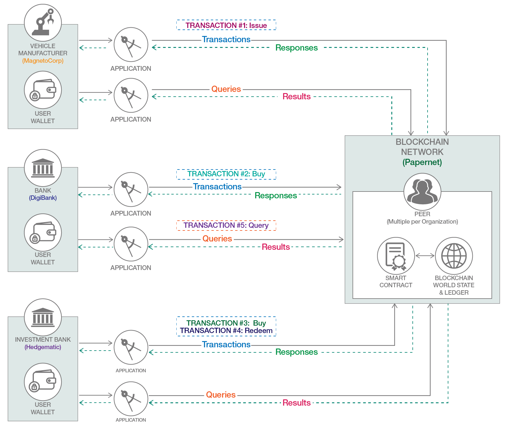
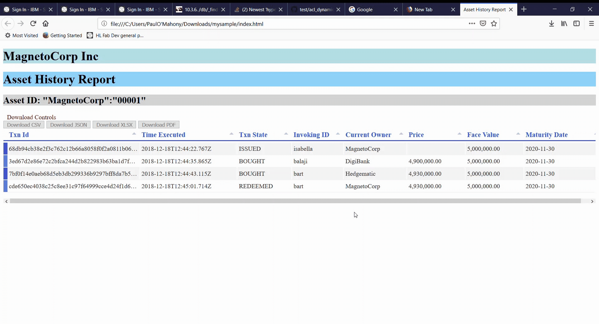

---

# Related publishing issue: https://github.ibm.com/IBMCode/Code-Tutorials/issues/479

abstract: "Learn how to add query functionality to a commercial paper smart contract with the IBM Blockchain VS Code extension, execute the queries from a client application, and render the transaction history of the commercial paper in a browser-based UI."

authors:
  - name: "Paul O'Mahony"
    email: "mahoney@uk.ibm.com"

# collections:		# Required=false

completed_date:	"2020-06-21"

components:
  - "hyperledger-fabric"
  - "hyperledger"
  - "vscode-extension"
  
draft: true

excerpt: "Add query functionality to a commercial paper smart contract with the IBM Blockchain VS Code extension, and render a full asset history in a browser-based UI application."

last_updated:	"2020-06-21"

meta_description: "Learn how to add query functionality to a commercial paper smart contract with the IBM Blockchain VS Code extension and then execute the queries from a client application, rendering them in Tabulator."

meta_keywords: "commercial paper, queries, smart contract, IBM blockchain, IBM blockchain platform, VS Code extension, Hyperledger Fabric"

meta_title: "Enhance and add queries to a commercial paper smart contract with the IBM Blockchain VS Code extension"

primary_tag: "blockchain"

pta:
 - "emerging technology and industry"

pwg:
  - "blockchain"

related_content:
  - type: tutorials
    slug: "run-commercial-paper-smart-contract-with-ibm-blockchain-vscode-extension"
  - type: articles
    slug: "make-smart-contracts-smarter-with-analytics"
  - type: patterns
    slug: "create-and-execute-blockchain-smart-contracts"

related_links:
  - title: "Video: Start developing with the IBM Blockchain Platform VS Code Extension"
    url: "https://youtu.be/0NkGGIUPhqk"
  - title: "Sample commercial paper smart contract"
    url: "https://github.com/hyperledger/fabric-samples"
  - title: "Hyperledger Fabric docs: Commercial paper tutorial"
    url: "https://hyperledger-fabric.readthedocs.io/en/master/tutorial/commercial_paper.html"

# runtimes:

services:
 - "blockchain"

subtitle: "Upgrade an existing commercial paper smart contract and get the full history of a commercial paper asset in a browser-based UI application"

tags:
  - "finance"

title: "Enhance and add queries to a commercial paper smart contract with the IBM Blockchain VS Code extension"

type: tutorial
---

In my tutorial [Run a commercial paper smart contract with the IBM Blockchain VS Code extension](https://developer.ibm.com/tutorials/run-commercial-paper-smart-contract-with-ibm-blockchain-vscode-extension/), I showed you how to deploy and interact with a commercial paper smart contract, exercising the lifecycle of a commercial paper asset. But what if you want to see the "paper" trail of all the activity that has taken place during its lifecycle, given that it can be sold many times in its lifetime? Specifically, to create a HTML 5 report of the immutable history of the asset (who did what, when it took place, etc.)?

**Figure 1. 'Commerce' network -- Overview of the commercial paper transaction flow**

This tutorial, is the second in a [three-part series](https://developer.ibm.com/series/blockchain-running-enhancing-commercial-paper-smart-contract/), shows you how to use the IBM Blockchain Platform VS Code extension to add query functions to the Fabric Samples Commercial Paper smart contract. You will use the extension to upgrade the contract after adding query functions. You'll implement the code changes by adding a new query class, and therein, functions to query key/extract data from the ledger. You'll then interact with the smart contract from a client application in DigiBank to get the history of transactions, then display its history in a nicely formatted UI/HTML table in a client browser. This tutorial is aimed at developers, and it provides detailed instructions (in particular, editing source files to add provided code blocks). Take time to see what's going on -- you don't necessarily have to understand JavaScript in great detail for this.

To complete these tasks, you'll use the IBM Blockchain Platform VS Code Extension, and use the newer Hyperledger Fabric programming model.

## Background

There is a fantastic description of the commercial paper use case scenario in the latest [Fabric Developing Applications]( https://hyperledger-fabric.readthedocs.io/en/master/tutorial/commercial_paper.html) docs, and the scenario depicted there makes for fascinating reading. In short, it's a way for large institutions/organizations to obtain funds to meet short-term debt obligations -- and a chance for investors to get a return on investment upon maturity.

The commercial paper scenario in the [last tutorial](https://developer.ibm.com/tutorials/run-commercial-paper-smart-contract-with-ibm-blockchain-vscode-extension/) began with employees from MagnetoCorp and DigiBank transacting as participants from their respective organizations, to create an initial history. In this tutorial, you'll complete the lifecycle but you'll add a third investor, Hedgematic, into the mix in order to show more historical data. (Creating this history is quick and easy.)

## Prerequisites

1. You will need to have completed the previous [commercial paper tutorial](https://developer.ibm.com/tutorials/run-commercial-paper-smart-contract-with-ibm-blockchain-vscode-extension/) -- specifically, you should have version 0.0.1 of the commercial paper smart contract package loaded into VS Code under your "Smart Contracts" in the "IBM Blockchain Platform" sidebar.

2. In VS Code, you'll need to have the running local 'Commerce' Fabric under "Fabric Environments" under the IBM Blockchain Platform extension, which you would have started in the [first tutorial](https://developer.ibm.com/tutorials/run-commercial-paper-smart-contract-with-ibm-blockchain-vscode-extension/) of this series.

3. If not already there, choose **File > Open Folder** in VS Code Explorer, and select the `contracts` folder (that you cloned) by navigating to the `$HOME/fabric-samples/commercial-paper/organization/magnetocorp` directory. The `contracts` folder must be your top-level project folder in VS Code (so the `package.json` file is active).

4. In the IBM Blockchain Platform VS Code Extension -- under the "Fabric Gateways" subpanel -- disconnect (using the icon) from any currently connected gateway, then connect to the `MagnetoCorp Gateway` (connects as the default `org1admin` admin identity). This is important, in order to have authority to upgrade the smart contract later on in this tutorial.

Completion of these prerequisites is required to start this tutorial. Next, you'll carry out important changes to your smart contract, and then try out the new transactions using the VS Code extension.

## Estimated time

Once the prerequisites are completed, this tutorial should take approximately 45-60 minutes to complete.
