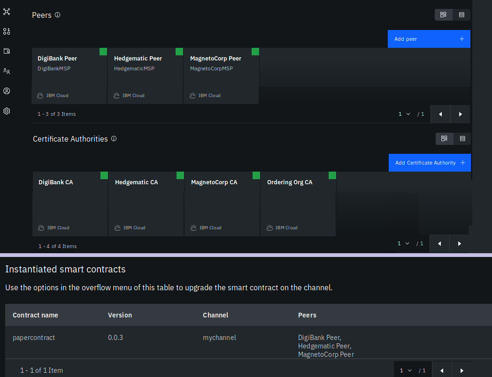

In the previous tutorial [tutorial 2](https://developer.ibm.com/tutorials/queries-commercial-paper-smart-contract-ibm-blockchain-vscode-extension), I showed you how, as a developer, you can add rich query functionality and enhance your smart contract using the IBM Blockchain VS Code extension. That tutorial enabled you to query the history and lifecycle of a commercial paper instance and report on it. Showing that immutable history is of course important, but what if you just want to know, for example, what changes were committed for each transaction in that history? Such a use case is relevant when you're dealing with large volumes of transactions, when you're looking for patterns, etc.

In this tutorial, you will provision a full blockchain network, consisting of 3 organisations in IBM Blockchain Platform in IBM Cloud. 

Having successfully upgraded the Commercial Paper smart contract ( on the'Commerce' network) in [tutorial 2](https://github.com/mahoney1/commercialpaper/blob/master/tutorial2-queries-commercial-paper-smart-contract-ibm-blockchain-vscode-extension.md), MagnetoCorp, DigiBank and Hedgematic - all part of the blockchain consortium - wish to deploy the new contract on their network in IBM Blockchain Platform in IBM Cloud. In this tutorial, you'll automatically provision this network, then deploy the smart contract. The last part will show you how client applications from any organisation, can interact with the ledger data - ie 'business as usual'.

**Figure 1. Overview diagram**

## Prerequisites

1. You need to have completed the previous two tutorials in this series.
2. Specifically, you will have version 0.0.2 of the commercial paper smart contract package `papercontract` package available under the `Smart Contracts` view in the IBM Blockchain Platform VS Code extension.

4.
